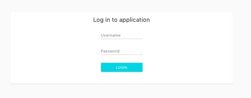
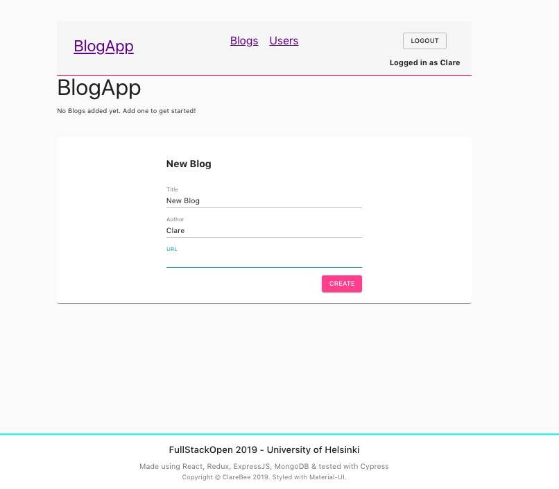
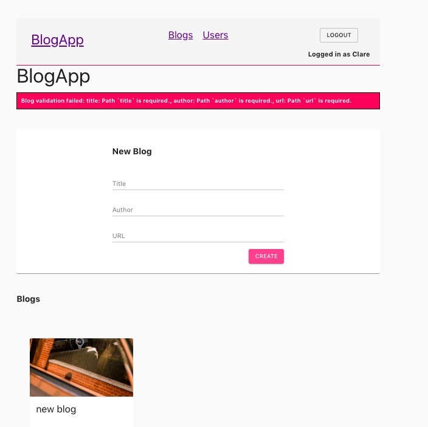
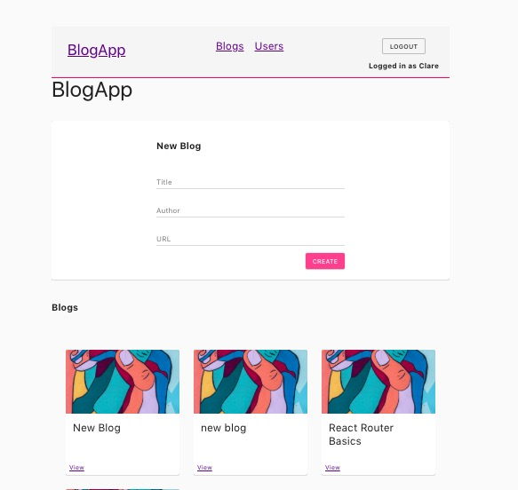
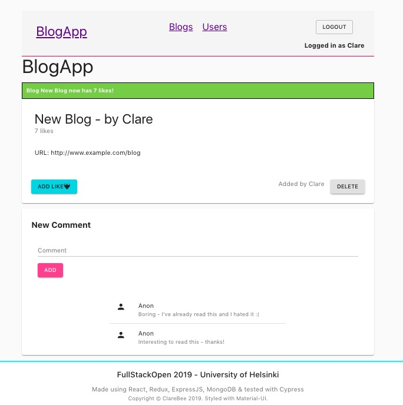

### Bloglist

*React 16.8.6, Redux, React Router, Cypress, MaterialUI*
A basic React App hooked up with an Express App/MongoDB database

#### FrontEnd

`npm run start`

App will start on port 3000

#### BackEnd

`npm run start`

App will start on port 3003

---

#### Run Tests:

As above but run backend with test context:
`npm run start:test`

Open new console for Cypress:
`npm run cypress:open`

Tests will launch in Chrome
(`npm run cypress:run` for headless version)
