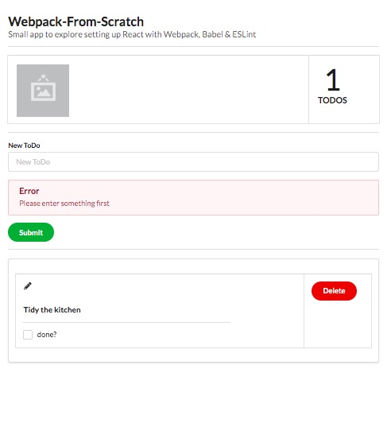
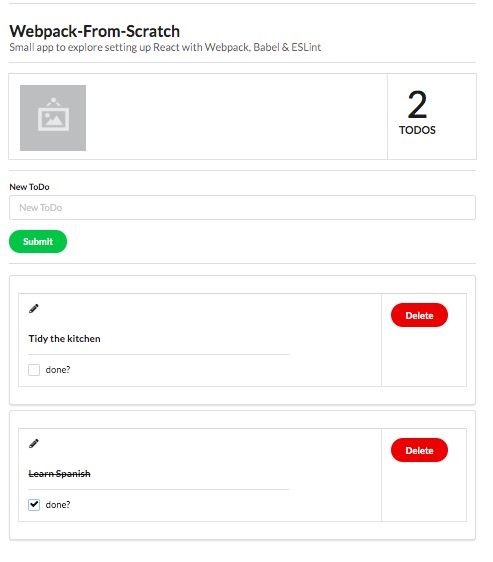

Basic ToDo App using React 16.9, Webpack 4 & Semantic UI React: https://react.semantic-ui.com/



---
## Learning Notes - setting up React with Webpack
1. **File structure**
Basic for starters (incl index.html, App.js etc.) - *from FullstackOpen*


2. Install **webpack**: `npm install --save-dev webpack webpack-cli`
3. Install **React**: `npm install --save react react-dom`
4. Install **loaders**:

```javascript
// for jsx
`npm install @babel/core babel-loader @babel/preset-react --save-dev`
`npm install --save-dev @babel/polyfill`
// ES5 compatibility
`npm install @babel/preset-env --save-dev`
// to load css files and inject style element (in main.js)
`npm install style-loader css-loader --save-dev`
// images
`npm install --save-dev file-loader`
```

5. Install **webpack-dev-server**
`npm install --save-dev webpack-dev-server`

6. Config in `webpack.config.js`

```javascript
const path = require('path')
const webpack = require('webpack') // for DefinePlugin

const backend_url = argv.mode === 'production'
    ? 'https://example.com/your-production-backend'
    : 'http://localhost:3004/notes' // db.json collection

const config = (env, argv) => {
  return {
    entry: ['@babel/polyfill', './src/index.js']
    output: {
      path: path.resolve(__dirname, 'build'),
      filename: 'main.js'
    },
    devServer: {
      contentBase: path.resolve(__dirname, 'build'),
      compress: true,
      port: 3000,
    },
    devtool: 'source-map', // for debugging by lines
    module: {
      rules: [
        {
          test: /\.js$/,
          loader: 'babel-loader',
          query: {
            presets: ['@babel/preset-env', '@babel/preset-react']
          },
        },
        {
          test: /\.css$/,
          loaders: ['style-loader', 'css-loader'],
        },
        {
          test: /\.(png|svg|jpg|gif)$/,
          use: [
            'file-loader'
          ]
        }
      ],
    },
    plugins: [
      new webpack.DefinePlugin({
        // global constant for use in code as BACKEND_URL
        BACKEND_URL: JSON.stringify(backend_url)
      })
    ]
  }
}
module.exports = config
```

7. **Scripts** in `package.json`:
```javascript
"scripts": {
  "build": "webpack --mode=production",
  "start": "webpack-dev-server --mode=development"
},
```

8. Root in `index.html` in build dir
```html
<!DOCTYPE html>
<html lang="en">
  <head>
    <meta charset="utf-8" />
    <title>React App</title>
  </head>
  <body>
    <div id="root"></div>
    <script type="text/javascript" src="./main.js"></script>
  </body>
</html>
```

9. Mount in `index.js`
```javascript
import React from 'react'
import ReactDOM from 'react-dom'
import App from './App'

ReactDOM.render(<App />, document.getElementById('root'))
```

10. React App.js

```javascript
import React from 'react'

const App = () => {
  return (
    <div className="container">
      ...
    </div>
  )
}
```

11. **Json-server** for dev, real url for prod:
https://github.com/typicode/json-server#getting-started
`npm i -g json-server`
`json-server --watch db.json --port 3004`

e.g. db.json

```json
{
  "todos": [
    {
      "done": true,
      "content": "study javascript",
      "id": "5a3b8481bb01f9cb00ccb4a9"
    },
    {
      "important": false,
      "content": "Mongo can save js objects",
      "id": "5a3b920a61e8c8d3f484bdd0"
    }
  ]
}
```

12. Cd into build dir and run `npx static-server`
=> bundled app served on http://localhost:9080

13. Promise polyfill
`npm i promise-polyfill`

```javascript
import PromisePolyfill from 'promise-polyfill'

if (!window.Promise) {
  window.Promise = PromisePolyfill
}
```

14. Re: create-react-app -> `npm run eject` - irreversible!
