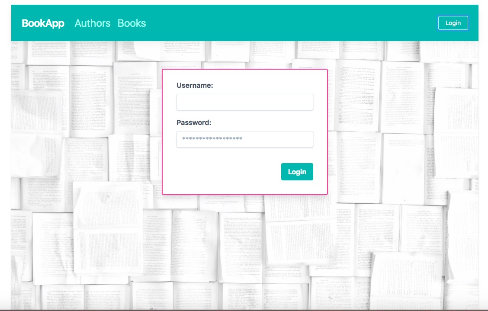
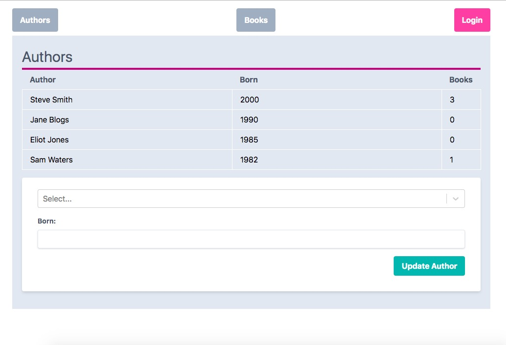
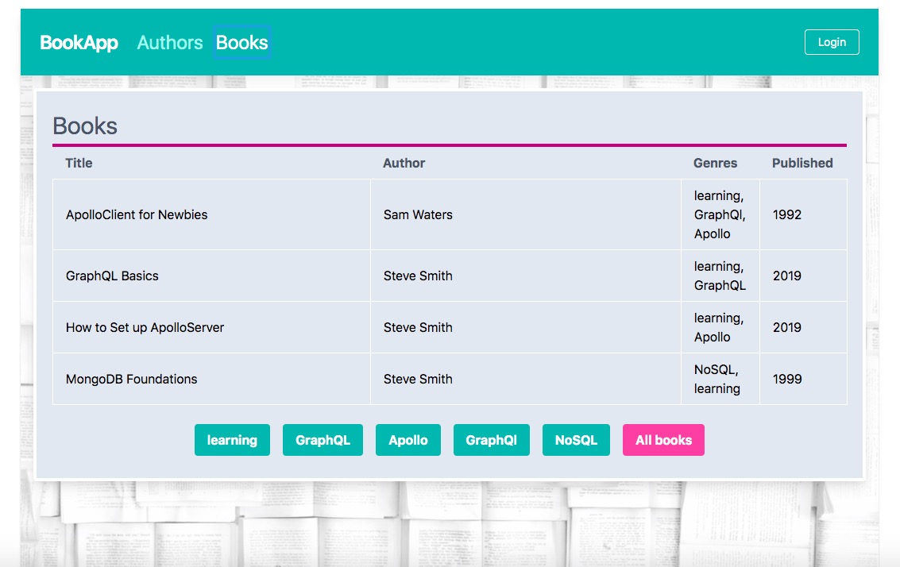
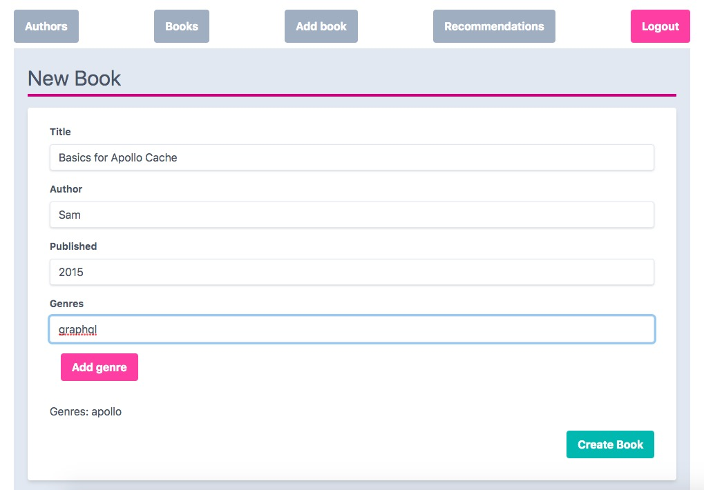
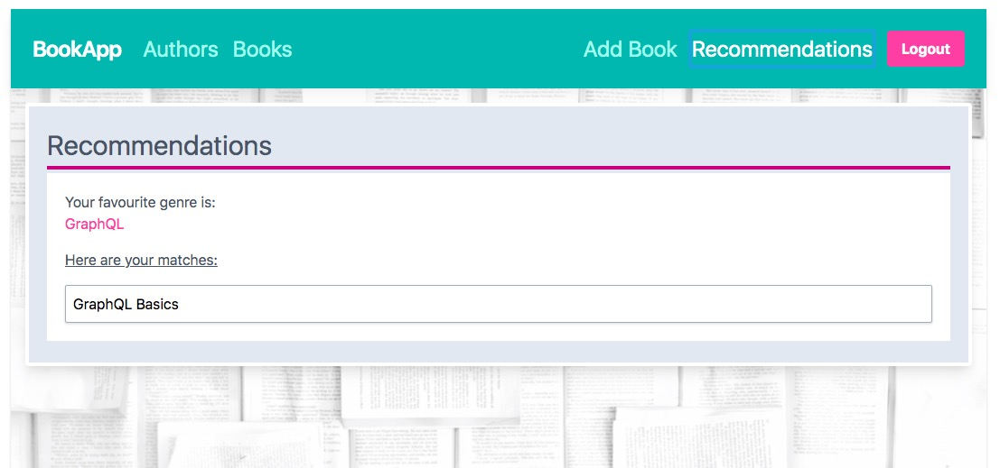

## Library App
- Simple app to add/edit books/authors to a collection
- Basic auth with JWT

To be run against NodeJS/GraphQL/ApolloServer Backend with a MongoDB database:
(https://github.com/ClareBee/fullstackopen/tree/master/08/books_graphql)

### How to run
`npm run start` opens app on `localhost:3000`

### Tech stack
- ReactJS with `create-react-app` - using hooks
- ApolloClient with `apollo-boost` - using hooks
- WebSockets with Apollo Subscriptions
- TailwindCSS & PostCSS

___

### Examples:

