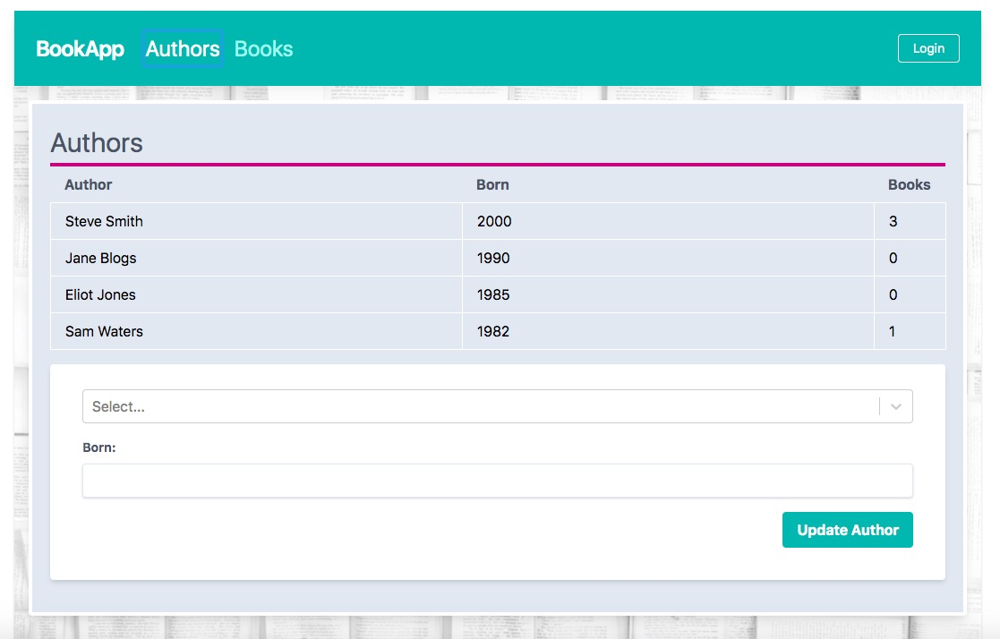

### Library App
Simple app to add/edit books/authors to a collection
Basic auth with JWT

To be run against NodeJS/GraphQL/ApolloServer Backend:
<!-- insert link -->

### How to run
`npm run start` opens app on `localhost:3000`

### Tech stack
- ReactJS via create-react-app
- ApolloClient with `apollo-boost` - using hooks
- WebSockets with Apollo Subscriptions
- TailwindCSS & PostCSS

<!-- insert screenshots -->
