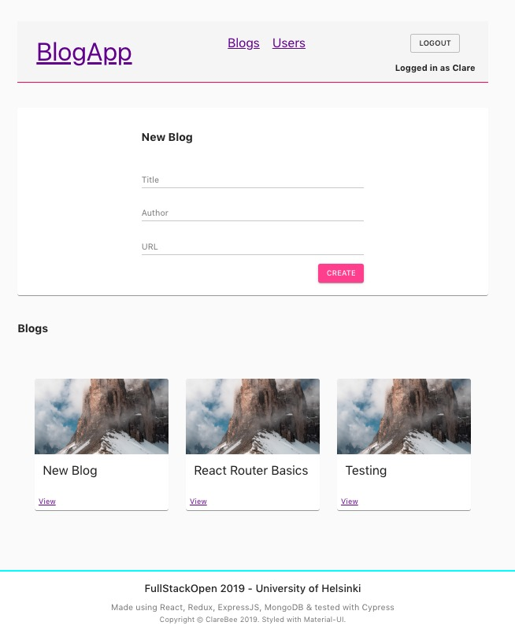

## FullStackOpen 2019 - Deep Dive into Modern Web Development
- https://fullstackopen.com/en

> The content is the same as in the Full stack course held at the Department of Computer Science at the University of Helsinki in Spring 2019.

___

## Final Projects: 

### Bloglist
- React/Redux FrontEnd with Custom Hooks: - [FrontEnd](https://github.com/ClareBee/fullstackopen/tree/master/07/bloglist_frontend_redux)

- Express.js & MongoDB BackEnd: - [BackEnd](https://github.com/ClareBee/fullstackopen/tree/master/07/blog_list_backend)

*Styled with MaterialUI, tested with Cypress & supertest*

### BooksApp
- React/ApolloClient FrontEnd with caching and basic auth: - [FrontEnd](https://github.com/ClareBee/fullstackopen/tree/master/08/library-frontend)
- GraphQL/ApolloServer/NodeJS BackEnd, using MongoDB/Mongoose: - [BackEnd](https://github.com/ClareBee/fullstackopen/tree/master/08/books_graphql)

*Styled with TailwindCSS*

**Examples:**
 
Webpack:

### Learning Notes

- https://github.com/ClareBee/fullstackopen/blob/master/LearningNotes.md
___

## Syllabus & Coursework
- [Part 8](https://github.com/ClareBee/fullstackopen/tree/master/08)
  * **GraphQL and Apollo **
  * GraphQL Server
  * React and GraphQL
  * Database and User Administration
  * Login and Updating the Cache
  * Fragments and Subscriptions
    * Coursework:
    - Final Project: BooksApp
      - [FrontEnd](https://github.com/ClareBee/fullstackopen/tree/master/08/library-frontend)
      - [BackEnd](https://github.com/ClareBee/fullstackopen/tree/master/08/books_graphql)
  
- [Part 7](https://github.com/ClareBee/fullstackopen/tree/master/07)
  * **ReactRouter, Styling, Webpack**
  * React Router
  * Coursework: [Routed Anecdotes](https://github.com/ClareBee/fullstackopen/tree/master/07/routed-anecdotes)
  * React Bootstrap, SemanticUI, Styled Components
  * Webpack config
  * Coursework: [Webpack From Scratch](https://github.com/ClareBee/fullstackopen/tree/master/07/webpack_from_scratch)
  * Legacy Class Components
  * E2E Testing with Cypress
  * Coursework:
    - Final Project: Bloglist
      - [FrontEnd](https://github.com/ClareBee/fullstackopen/tree/master/07/bloglist_frontend_redux)
      - [BackEnd](https://github.com/ClareBee/fullstackopen/tree/master/07/blog_list_backend)

- [Part 6](https://github.com/ClareBee/fullstackopen/tree/master/06)
  * **State Management with Redux**
  * Flux architecture & Redux
  * Combined Reducers, Connect
  * Redux Thunk & Redux Devtools
  * Coursework: [Unicafe with Redux](https://github.com/ClareBee/fullstackopen/tree/master/06/unicafe-redux)
  * Coursework: [Anecdotes with Redux](https://github.com/ClareBee/fullstackopen/tree/master/06/redux-anecdotes)
  
- [Part 5](https://github.com/ClareBee/fullstackopen/tree/master/04_05)
  * **Testing React Apps, Custom Hooks**
  * FrontEnd Login
  * PropTypes
  * Testing w react-testing-library
  * Custom Hooks
  * Coursework: [Bloglist](https://github.com/ClareBee/fullstackopen/tree/master/04_05/bloglist-frontend)
  * Coursework: [Phonenumber Hooks](https://github.com/ClareBee/fullstackopen/tree/master/04_05/phonenumber_hooks)
  
- [Part 4](https://github.com/ClareBee/fullstackopen/tree/master/04_05)
  * **Testing Express apps, User administration**
  * Project structure
  * Testing w supertest
  * User admin
  * Token authentication, Middleware
  * Coursework: [Bloglist](https://github.com/ClareBee/fullstackopen/tree/master/04_05/blog_list)
  
- [Part 3](https://github.com/ClareBee/fullstackopen/tree/master/03)
  * **Programming a Server with Node.js & Express.js**
  * Node.js & Express.js
  * Deploying with Heroku
  * MongoDB & Mongoose
  * Validation, ESLint
  * Coursework: [Phonebook Backend](https://github.com/ClareBee/fullstackopen/tree/master/03/phonebook_backend)
  
- [Part 2](https://github.com/ClareBee/fullstackopen/tree/master/02)
  * **Communicating with Servers**
  * Collections, Anti-patterns
  * Forms
  * Getting data from server
  * Submitting data to server, REST
  * Styling React Apps
  * Coursework: [Course Contents](https://github.com/ClareBee/fullstackopen/tree/master/02/course-contents)
  * Coursework: [Phonebook](https://github.com/ClareBee/fullstackopen/tree/master/02/phonebook)
  * Coursework: [Data for Countries](https://github.com/ClareBee/fullstackopen/tree/master/02/data-for-countries)
  
- [Part 1](https://github.com/ClareBee/fullstackopen/tree/master/01)
  * **Intro to React**
  * JavaScript
  * Coursework: [Course Information](https://github.com/ClareBee/fullstackopen/tree/master/01/courseinfo/newcourseinfo)
  * Coursework: [Anecdotes](https://github.com/ClareBee/fullstackopen/tree/master/01/anecdotes)
  * Component State, Event Handlers
  * Complex State, Debugging
  * Coursework: [Unicafe](https://github.com/ClareBee/fullstackopen/tree/master/01/unicafe)
  
- [Part 0](https://github.com/ClareBee/fullstackopen/tree/master/00_Fundamentals_of_Web_Apps)
  * **Fundamentals of Web Apps**
  * Coursework: [Notes](https://github.com/ClareBee/fullstackopen/tree/master/00_Fundamentals_of_Web_Apps)

